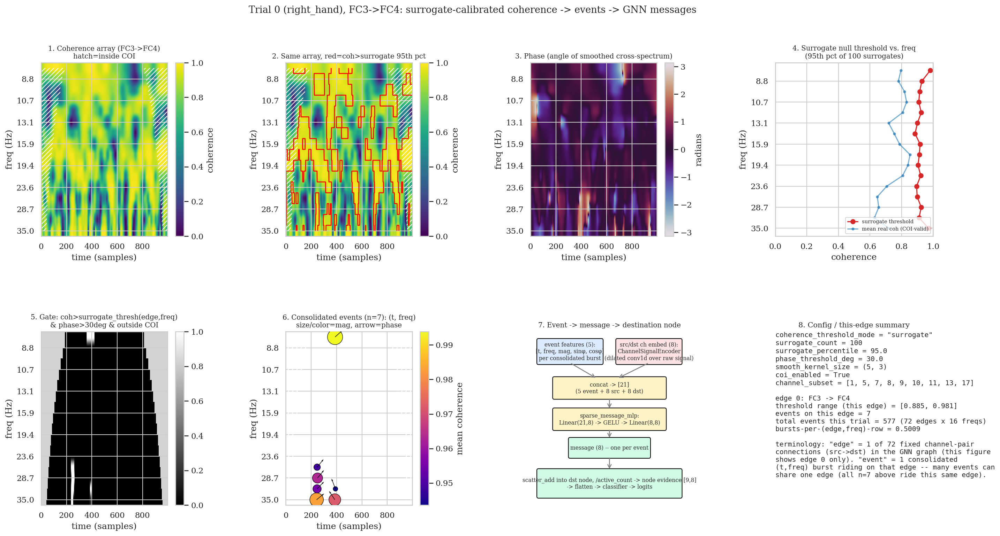
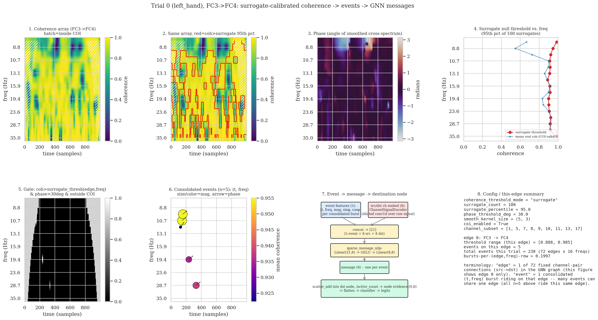
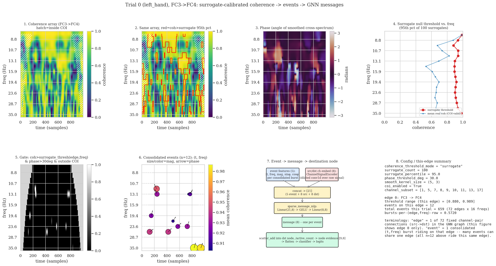
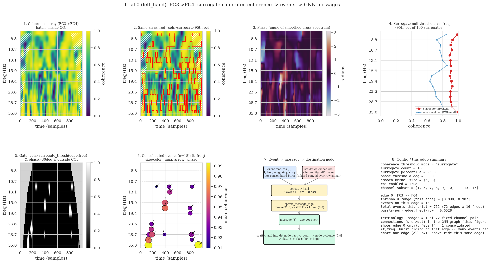
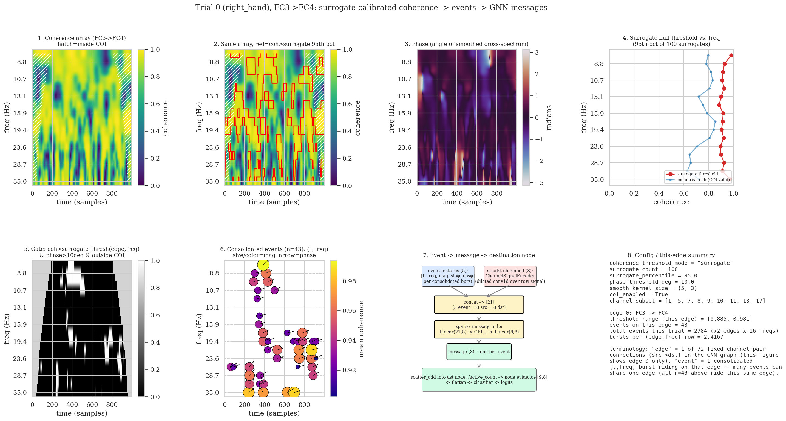
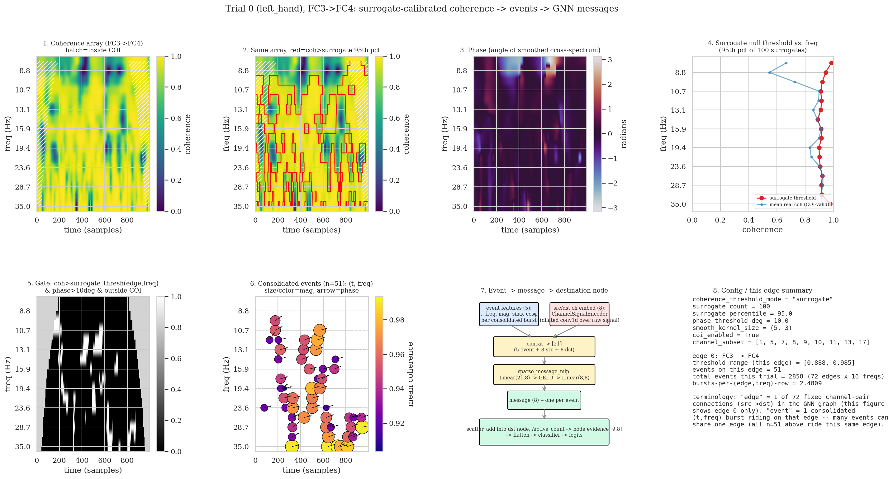
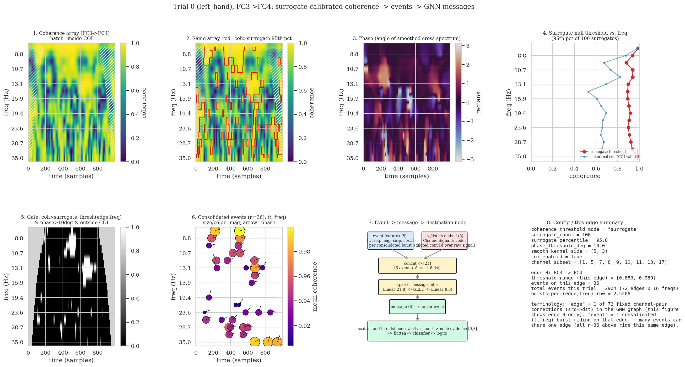
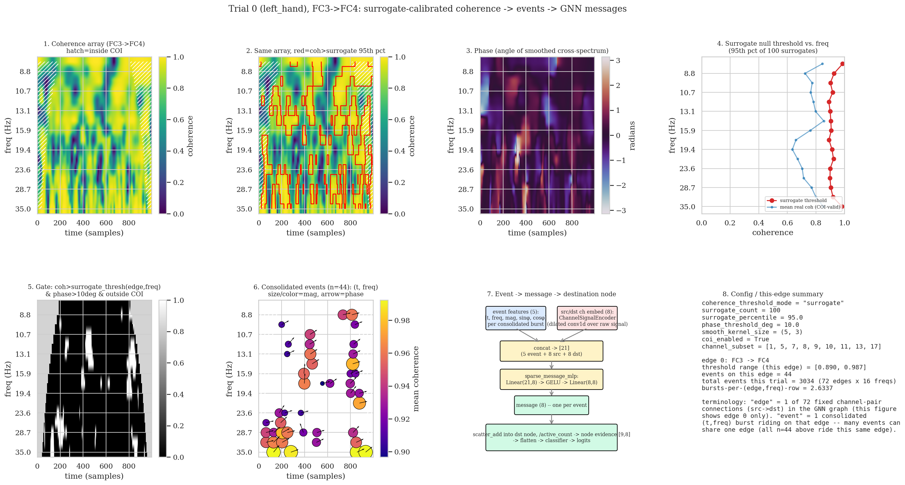

# Session notes — surrogate-pipeline debug plots + subject-2 event-starvation finding (2026-08-08)

Branch: `channel_subset`. Repo: `/Users/noahshore/Documents/CoherIQs/moabb`.
Continues from [2026-08-07_cross_subject_eval_and_phase_gate_direction_fix.md](2026-08-07_cross_subject_eval_and_phase_gate_direction_fix.md)
-- see that file for the phase-gate direction-bug investigation and the
canonical config as of 2026-08-07 (still current here).

---

## Arc 1 — New debug script: `debug_sparse_evidence_gnn.py`

Added
[BCI/moabb_pipelines/debug_sparse_evidence_gnn.py](../moabb_pipelines/debug_sparse_evidence_gnn.py),
the `coherence_threshold_mode="surrogate"` successor to the earlier
fixed-threshold `debug_plots/edge0_to_messages_native_coi.png`-style
figures (those had no accompanying script committed -- this one is
committed). Every number plotted comes from calling the REAL pipeline
methods directly (`SparseEvidenceGNNCore._coherence_only`,
`_coi_valid_mask`, `compute_events`, `SparseEvidenceGNNClassifier.
_surrogate_coherence_threshold`) -- nothing is reimplemented, so the
figure always reflects exactly what training/eval computes.

Final 8-panel layout (2x4), one edge/trial per figure:
1. Coherence array, plain (hatch = inside COI)
2. Same array, red contour = coherence above the surrogate 95th-percentile
   per-(edge,freq) threshold (coherence half of the gate only)
3. Phase (angle of smoothed cross-spectrum)
4. Surrogate null threshold vs. frequency, alongside mean real coherence
5. Full gate: coh>surrogate_thresh(edge,freq) & phase>threshold & outside COI
6. Consolidated events as points: (t, freq), size/color=mean coherence,
   arrow=mean phase angle
7. Static event -> message -> destination-node architecture diagram
8. Config + this-edge summary (includes an explicit "edge" vs. "event"
   terminology note -- "edge" = 1 of the 72 fixed channel-pair connections
   in the GNN graph; "event" = 1 consolidated burst riding on that edge,
   many events can share one edge)

Iterated based on live feedback into this final form: originally 6 panels
mirroring the old fixed-threshold figure exactly, then added the
threshold-vs-frequency panel and a config-summary panel (8 total), then
added the plain-coherence panel and dropped a redundant
centroid-only panel (net panel count unchanged), shortened the suptitle,
and switched from raw channel indices (`ch1->ch5`) to real electrode names
(`FC3->FC4`) via `return_epochs=True`.

Two real bugs found and fixed along the way:
- **Quiver arrows all rendering at ~90 degrees.** Not a data bug --
  verified the actual `mean_angle` values behind the arrows range widely
  (e.g. 32-130 degrees for one edge, not clustered near 90). The bug was
  feeding a true `(cos, sin)` unit vector into `quiver(angles="xy")` on
  axes whose x-range (~1000 time samples) and y-range (~16 freq bins) are
  wildly different in data units -- the horizontal component rendered
  ~60x smaller on screen than the vertical one regardless of the real
  angle. Fixed by scaling dx/dy by each axis's own data range before
  plotting.
- **`return_epochs=True` skips MOABB's `unit_factor` scaling.** Switching
  to `paradigm.get_data(..., return_epochs=True)` (to get real channel
  names from `epochs.info['ch_names']`) bypasses the array pipeline that
  the default `return_epochs=False` path uses, which multiplies
  `epochs.get_data()` by `dataset.unit_factor` (1e6 for BNCI2014-001,
  Volts -> microvolts; see `moabb/paradigms/base.py`'s
  `_get_array_pipeline`). Without it the raw signal was ~1e6x too small,
  which collapsed the surrogate threshold to all zeros and produced 43
  spurious events regardless of `phase_threshold_deg`. Fixed by applying
  `* dataset.unit_factor` by hand after `epochs.get_data()`.
- **Output filename collision.** The filename didn't include the subject
  number (`edge{N}_surrogate_pipeline_trial{N}_phase{N}deg.png`), so
  running `--subject 2` silently overwrote the `--subject 1` PNG. Fixed
  by prefixing `subj{N}_`; both subject-1 files were regenerated after
  being clobbered once.

## Arc 2 — Subject 2's near-chance canonical-sparse score: event starvation, not a flood

A canonical-sparse run on subject 2 alone scored **0train=0.4817,
1test=0.4994, mean=0.4905** -- essentially chance. Used the Arc 1 script
(`--subject 2`) to compare against subject 1 on the same edge
(`FC3->FC4`, edge 0) and same trial index:

**Subject 1, trial 0 (right_hand):**

**Subject 2, trial 0 (left_hand):**

On this one edge the two look fairly similar (7 events for subject 1 vs.
5 for subject 2). Checking trial-wide totals (all 72 edges x 16 freqs)
across 5 trials each told a clearer story:

| subject | trial0 | trial1 | trial2 | trial3 | trial4 | mean bursts-per-row |
| --- | --- | --- | --- | --- | --- | --- |
| 1 | 577 | 629 | 654 | 569 | 606 | ~0.53 |
| 2 | 230 | 316 | 453 | 204 | 301 | ~0.26 |

**Finding: subject 2 gets roughly half the total consolidated events per
trial as subject 1, consistently across all 5 trials checked -- event
starvation, not a flood.** Notably, subject 2's *raw* coherence (panel 1
above) is actually *more* saturated than subject 1's, not less -- nearly
solid high coherence (~0.9-1.0) across most of the time/frequency plane.
But the surrogate null threshold tracks right along with it (subject 2:
[0.888, 0.985] vs. subject 1: [0.885, 0.981] on this edge -- barely
different), because the null is built from phase-randomized surrogates of
that same signal: if the real signal is more globally coherent/noise-like
with less contrast, its null rises almost exactly as much. Net effect:
fewer (edge, freq, time) cells clear the co-moving threshold *and* the
phase gate *and* survive long enough to consolidate into a run. Subject 2
isn't lacking coherence -- it's lacking genuine, phase-consistent bursts
that stand out from its own (elevated) noise floor.

Practical read: `SparseEvidenceGNNCore.forward()`'s `scatter_add`/
`active_count` averaging has roughly half as many messages to average per
destination node for subject 2, so each surviving (possibly spurious)
event carries proportionally more weight in that node's evidence vector --
noisier per-node representations, less redundancy to average out one bad
event.

This is consistent with, not a new contradiction of, the already-recorded
finding that subject 2 sits near chance across *other* architectures too
(`sparse_evidence_gnn_classifier.py`'s module docstring: EEGNet at 100
epochs gets 0.603 on subject 2) -- reads as a property of this subject's
recording, not a bug this investigation uncovered.

## Arc 3 — Subjects 3 and 4: event starvation does NOT generalize to subject 4

Same script/edge/trial-0, run for subject 3 (near-ceiling accuracy,
~0.94 in the 4-subject canonical baseline) and subject 4 (the *other*
near-chance subject, ~0.54-0.62 across runs), to check whether subject 4
shows the same event-starvation pattern as subject 2.

**Subject 3, trial 0 (left_hand):**

**Subject 4, trial 0 (left_hand):**

Same 5-trial-each check as Arc 2, added to the same table:

| subject | accuracy (canonical) | trial0 | trial1 | trial2 | trial3 | trial4 | mean bursts-per-row |
| --- | --- | --- | --- | --- | --- | --- | --- |
| 1 | 0.801 | 577 | 629 | 654 | 569 | 606 | ~0.53 |
| 2 | ~0.49-0.56 (chance) | 230 | 316 | 453 | 204 | 301 | ~0.26 |
| 3 | 0.947 | 659 | 571 | 615 | 705 | 527 | ~0.53 |
| 4 | 0.538-0.624 (chance) | 752 | 555 | 752 | 573 | 782 | **~0.59** |

**Finding: subject 4's near-chance accuracy is NOT explained by event
starvation -- it's the opposite of subject 2's pattern.** Subject 4
consistently has *more* consolidated events per trial than subject 1
(good) or subject 3 (best), not fewer. So there isn't one single
"low-signal-quality" failure mode this pipeline is sensitive to; subject 2
and subject 4 both score near chance but for what look like different
underlying reasons:
- Subject 2: too few surviving events (genuine phase-consistent bursts are
  scarce relative to an elevated noise floor) -- the GNN has too little
  evidence per trial.
- Subject 4: plenty of surviving events (as many or more than the best
  subject), but accuracy is still near chance -- consistent with those
  events being abundant but not *class-discriminative* (i.e. passing the
  surrogate significance test in both left_hand and right_hand trials
  roughly equally, diluting rather than starving the evidence). Not yet
  directly verified (would need to compare event counts/positions between
  the two classes for subject 4 specifically); recorded here as the
  leading hypothesis from what this session's numbers rule out, not a
  confirmed mechanism.

## Arc 4 — Re-plotting all four subjects at phase_threshold_deg=10: subject 2's starvation is mostly a phase-threshold artifact

Arcs 2-3 used the canonical `phase_threshold_deg=30`. Re-ran all four
subjects (same edge/trial-0) at `phase_threshold_deg=10` -- the tighter
setting the *fixed*-mode canonical config independently converged on (see
[2026-08-07 notes](2026-08-07_cross_subject_eval_and_phase_gate_direction_fix.md#L188-L193))
-- to see whether the phase gate specifically was responsible for subject
2's starvation.

Same 5-trial-each check, mean bursts-per-row at both phase settings side
by side:

| subject | mean bursts-per-row @ phase=30deg | mean bursts-per-row @ phase=10deg | subj/subj1 ratio @30deg | ratio @10deg |
| --- | --- | --- | --- | --- |
| 1 | 0.527 | 2.443 | 1.00 | 1.00 |
| 2 | 0.261 | 2.542 | **0.50** | **1.04** |
| 3 | 0.534 | 2.579 | 1.01 | 1.06 |
| 4 | 0.593 | 2.664 | 1.13 | 1.09 |

**Subject 2's event deficit essentially disappears at the looser phase
threshold.** At `phase=30deg` subject 2 gets about half the events of
subject 1 (the dramatic starvation from Arc 2). At `phase=10deg`, all four
subjects converge to within ~10% of each other's event density, and
subject 2 is no longer the outlier low value -- it's essentially tied with
subject 1. This points at the *phase* gate (`phase > phase_threshold_rad`,
not the coherence/surrogate-threshold gate) as the specific mechanism
behind subject 2's starvation at the canonical 30 degree setting: subject
2 apparently has plenty of coherent-AND-significant activity whose phase
just doesn't concentrate as tightly as subject 1/3's does, so a strict
phase cutoff disproportionately discards it.

Subject 4 stays the highest-density subject at *both* phase settings
(0.593 and 2.664, both the top of the four) -- consistent with Arc 3's
read that subject 4's problem isn't scarcity at any phase threshold tried
so far, reinforcing that subject 2 and subject 4's near-chance scores
likely have different root causes.

**Not yet tested: whether this phase=10deg density recovery for subject 2
actually helps its classification accuracy.** This arc only looked at
event counts, not a real training run -- the canonical-sparse config used
in Arc 2 (which produced the 0.4905 mean) had `phase_threshold_deg=30`;
whether subject 2 specifically (not just subject 1/3, which are already
fine) improves at `phase_threshold_deg=10` is an open, directly
actionable next step.

## Arc 5 — Mechanism behind subject 2's mu-band loss: phase and coherence peak at different mu-band cells

User-spotted from the phase panel (panel 3) of the subject-2 figure: only
two visually salient ("bright") regions, both in the mu band, and they
appeared to be filtered out by the coherence/surrogate gate rather than
surviving into events. Verified directly against the real per-cell gate
arrays (not just visually) for edge 0 (`FC3->FC4`), subject 2, trial 0,
`phase_threshold_deg=30`:

| freq | surrogate threshold | cells passing phase>30deg | cells passing coh>threshold | cells passing **both** |
| --- | --- | --- | --- | --- |
| 9.7 Hz | 0.922 | 131 | 199 | 10 |
| 8.8 Hz | 0.946 | **112** | 16 | **0** |
| 8.0 Hz | 0.985 | **128** | **0** | **0** |

Confirmed: the two lowest mu-band bins (8.0, 8.8 Hz) have *more*
phase-consistent cells than any other frequency in the whole spectrum
(every other bin tops out around 50-ish) -- these are the two bright
regions in panel 3. But at 8.0 Hz literally zero cells anywhere in the
trial ever clear the coherence threshold (mean coherence where the phase
gate passes is only 0.705, threshold is 0.985), so none of that
phase-locked mu activity survives into an event.

Checked whether this is subject-2-specific or a general pipeline property
by running the same breakdown on subject 1's edge 0:

| | subj 1 @ 8.8Hz | subj 1 @ 8.0Hz | subj 2 @ 8.8Hz | subj 2 @ 8.0Hz |
| --- | --- | --- | --- | --- |
| threshold | 0.929 | 0.981 | 0.946 | 0.985 |
| coh-passing cells | 234 | 90 | 16 | 0 |
| **both** | 0 | **62** | 0 | 0 |

Subject 1 has the identical problem at 8.8 Hz (0 events survive there
too), but recovers at the *adjacent* 8.0 Hz bin -- 62 cells clear both
gates, which is exactly the one large, high-coherence (~0.99) mu-band
event visible at the top of subject 1's event panels (panel 6) in Arcs 2
and 4. Subject 2 loses **both** neighboring mu bins entirely -- it has
comparable or greater phase-locked mu activity than subject 1, but none
of it clears the coherence bar at either bin, so it contributes zero
mu-band events instead of subject 1's one salient one.

Refines Arc 2's read: it isn't just that subject 2 has fewer events
overall -- the mu band specifically (the band most associated with motor
imagery) is where subject 2 loses the *most* phase-consistent activity to
the coherence-significance filter, while subject 1 loses it at one
adjacent bin but keeps it at the next. Consistent with Arc 4's finding
that loosening `phase_threshold_deg` recovers subject 2's overall event
count -- this arc shows concretely *which* frequency band that recovery
would need to come from.

## Arc 6 — `coherence_threshold_mode="surrogate_cluster"`: cache-backfill fix + progress indicator

Before attempting a cluster-mode run for subject 2 (see Arc 7), landed two
small infrastructure fixes to `sparse_evidence_gnn_classifier.py`:

1. **`_surrogate_null_percentile_grid` now always computes+caches
   `cluster_null` on any fresh (cache-miss) pass**, not only when the
   calling mode explicitly needs it. Measured cost of adding it while
   `coh_all` is already in memory: ~5% (5.22s plain vs 5.29s with
   cluster_null, one BNCI2014-001 trial, `surrogate_count=100`) -- because
   `coh_all` (the expensive part -- full CWT/cross-spectrum/smoothing per
   surrogate) was already being computed regardless; cluster_null just
   reuses it. Since `coh_all` itself is never persisted (it's ~4.3GB per
   trial for this config -- 100 surrogates x 72 edges x ~1000 time x 16
   freq -- far too large to cache), a cache entry written without
   cluster_null could previously only get one by fully regenerating every
   surrogate from scratch. Now any trial touched from here on, by either
   `"surrogate"` or `"surrogate_cluster"` mode, becomes cluster-aware in
   the cache the first time it's computed, so switching modes later never
   re-pays this cost for that trial. Entries already on disk before this
   change still need a one-time recompute+backfill the first time cluster
   mode asks for them (verified both behaviors directly: cache hit stays
   instant, first cluster-mode request against an existing plain-mode
   entry is a full ~5-6s recompute, second request is instant).
2. **Progress indicator** for `_precompute_sparse_events`'s per-trial
   surrogate/cluster calibration loop (the expensive path, easily minutes
   at `surrogate_count~100` with no cache hit) -- a `tqdm` bar plus a
   one-line print of the trial count/chunk size/surrogate count, gated on
   `self.verbose >= 1` like the rest of this pipeline's console output.

## Arc 7 — Cluster mode scoped per-edge: still too conservative to be useful, even for subject 1

Before touching training config, checked whether the whole-graph pooled
null (Arc from the prior conversation, not written to this file since it
was caught before any code was changed) was really the problem, by
re-scoping `SparseEvidenceGNNCore._max_cluster_statistic` to compute the
null **per edge** (16 freq x ~1000 time cells, ~16K) instead of pooled
across all 72 edges (~1.15M cells) -- the textbook fix, matching what
Maris & Oostenveld cluster correction is *supposed* to scope to (one
"family" per meaningfully-distinct test, here one edge/channel-pair, not
the whole sensor array at once). Required threading a per-edge cutoff
(`[B, E]`, not a single scalar per trial) through
`_surrogate_cluster_thresholds`, `_precompute_sparse_events`'s
`cluster_cutoffs` tensor, and `_build_sparse_events`'s
`null_per_run = cluster_mass_null_threshold[b_of_run, e_of_run]`
indexing; also added a shape check to `load_surrogate_null_cache` so a
`cluster_null` written under the old whole-trial-scalar scheme (1-D, not
`[N, E]`) is treated as a stale-format miss rather than silently
misinterpreted.

The re-scoping is correct and helps somewhat -- confirmed subject 1's real
data occasionally *does* clear the narrower per-edge bar (unlike the
whole-graph version, which rejected every trial at every forming
threshold tried, 70th-99.5th percentile):

| subject | forming_pct=90 | forming_pct=80 | forming_pct=60 |
| --- | --- | --- | --- |
| 1 | 4/72 edges significant, 4 events | 1/72, 1 event | 1/72, 1 event |
| 2 | 0/72 edges significant, 0 events | 0/72, 0 events | 0/72, 0 events |

**But it's still not usable.** Even subject 1 -- the well-behaved subject
that gets ~577-654 events/trial under plain `"surrogate"` mode (Arc 2) --
only clears the cluster-corrected bar on 1-4 of 72 edges, meaning the
model would train on a near-total evidence vacuum even for its best
subject. And subject 2 specifically -- the subject this was meant to
help -- gets exactly **zero** significant edges at every forming
threshold tried, same outcome as the unscoped version. The per-edge
correction is a real improvement in principle (smaller, more
sensible-looking null values; verified subject 1 can occasionally clear
it at all, which never happened under the whole-graph pooling) but the
cluster-mass statistic itself appears to be a poor fit for this
pipeline's small `(5,3)` smoothing kernel: the same "raw coherence is
inherently biased toward 1.0 under the null even with zero true coupling,
because a 5-sample time kernel gives few degrees of freedom" property
already documented for the flat-percentile threshold (see 2026-08-07
session notes) plausibly also inflates spurious cluster *lengths* under
the null via the same temporal autocorrelation -- so real clusters rarely
look much bigger than the biggest spurious one, even scoped to a single
edge. Not fully root-caused; recorded as the leading hypothesis, not
confirmed.

**Decision: did not launch a training run.** Both the whole-graph and
per-edge versions would produce a pipeline with almost no events at all,
for every subject -- not a subject-2-specific fix, a regression across
the board. The cluster-mode code changes (per-edge scoping, cache fixes,
progress indicator) are kept since they're correct and independently
useful groundwork (particularly the cache-backfill fix, which helps
`"surrogate"` mode too), but `coherence_threshold_mode="surrogate_cluster"`
itself is not recommended for use against this pipeline's current
smoothing-kernel configuration without further investigation.

## Where things stand / open threads (this file)

- `debug_sparse_evidence_gnn.py` is now a committed, reusable tool --
  `python BCI/moabb_pipelines/debug_sparse_evidence_gnn.py
  --subject N --trial N --edge N --phase-threshold-deg N --out
  debug_plots/surrogate_pipeline` -- for inspecting any subject/trial/edge
  under the current surrogate-calibrated pipeline.
- **Most actionable next step (still Arc 4, reaffirmed by Arc 7's negative
  result): run a real canonical-sparse training pass on subject 2 with
  `phase_threshold_deg=10` instead of 30.** This remains the only approach
  in this file that's actually been shown (via event-count evidence, not
  yet a real accuracy run) to plausibly help subject 2 without a
  from-scratch statistical redesign.
- If cluster mode is revisited: the likely next step is investigating
  whether a larger smoothing kernel (traded off against the native-
  resolution benefits documented in
  `sparse_evidence_gnn_classifier.py`'s module docstring) reduces the
  null's temporal-autocorrelation inflation enough for cluster mass to
  actually discriminate real from spurious clusters -- untested here.
- Also not yet done: checking whether subject 4's events actually differ
  between left_hand/right_hand trials (class-discriminativeness), the
  same starvation/flood check on edges other than `FC3->FC4`, or whether
  loosening `surrogate_percentile` (e.g. to 90, in PLAIN "surrogate" mode,
  not cluster mode) recovers enough events for subject 2 without also
  flooding subject 1/3 with noise -- see
  [[sparse-evidence-gnn-seed-variance]] for the existing seed-variance
  caveat on any single-run number quoted here (all numbers above are
  single-seed).
