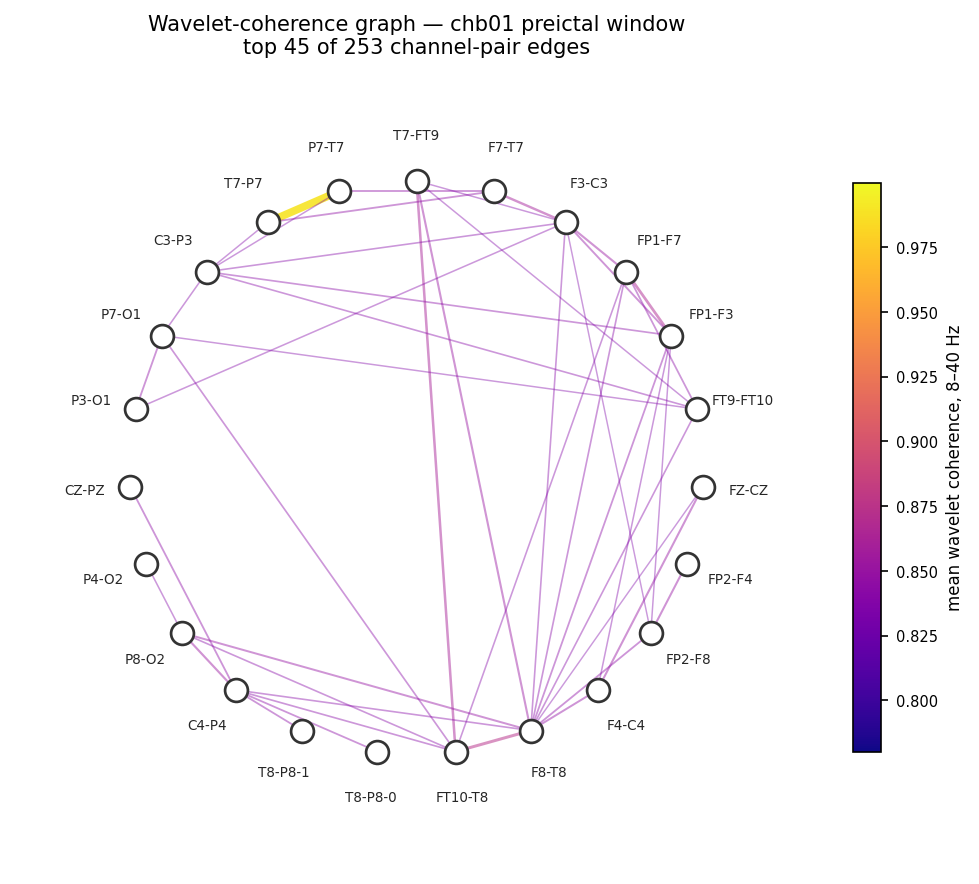
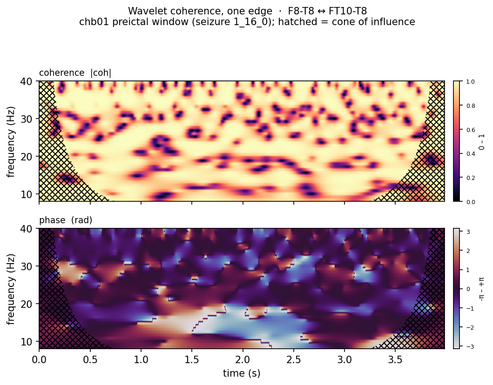

# EEG_Benchmarks

A research bench for **EEG classification under leakage-resistant
evaluation**. Two domains share one codebase, one shared training loop,
and one results layout:

1. **BCI / motor imagery** — pipelines evaluated on
   [MOABB](https://moabb.neurotechx.com) benchmarks (`BCI/`).
2. **Epilepsy** — CHB-MIT scalp EEG, seizure **prediction** (preictal vs
   interictal) and seizure **detection** (ictal vs non-ictal), under a
   strict leave-one-seizure-out protocol (`Epilepsy/`).

The point of the repo is the *evaluation*, not any one model. Published
seizure-prediction/detection numbers are hard to compare because almost
every paper uses its own split, horizon, and preprocessing — and random
splits over overlapping windows leak. Here, faithful reimplementations of
published architectures and several original ones are run head-to-head
under a single protocol with the leakage paths closed.

<p align="center">
  
  
</p>

Several pipelines here consume a **wavelet-coherence graph**: nodes are the
bipolar EEG channels, edges carry the time–frequency coherence and phase
between each channel pair. Left: that graph for one real chb01 preictal
window (strongest 45 of 253 edges). Right: what a single edge carries —
coherence magnitude and phase over the 4 s window, 8–40 Hz. Both are
computed by the real pipeline; regenerate with the scripts in
`docs/assets/`, full export (all 253 edges, raw arrays) in
`exports/coherence-graph/`.

## What's in it

### Epilepsy pipelines (`Epilepsy/run_pipelines.py`)

Reimplementations, each built from the paper's spec (not vendored code):

| pipeline | source | input |
|---|---|---|
| `slimseiz` | SlimSeiz (adaptive channel selection) | raw EEG |
| `dbconformer` | DBConformer | raw EEG |
| `cg_mambanet` | CG-MambaNet | raw EEG |
| `godoy_tmc` | Godoy et al. TMC-T (conv-tokenizer + Transformer) | raw EEG |
| `truong_stft_cnn` | Truong et al. 2018 (STFT + CNN) | STFT |

Original architectures built here:

| pipeline | idea | input |
|---|---|---|
| `temporal_graph_mamba` | wavelet coherence graph → per-channel selective SSM (Mamba) → logits | CWT coherence graph |
| `dense_edge` / `dense_edge_gru` / `dense_edge_mamba` | dense edge-feature graph with a Conv2d / per-edge GRU / Mamba temporal step | CWT coherence graph |
| `hermitian_ssm` | eigendecomposition of the Hermitian coherence matrix → selective SSM | CWT coherence graph |
| `continuous_cwt_mamba` | streaming (carried-state) variant for continuous recordings | CWT coherence graph |

Every pipeline respects `--label-mode {prediction,detection}` and writes
to a per-pipeline, per-mode results directory. Detection and prediction
numbers are **never pooled** — different tasks, different ceilings (see
`Epilepsy/results/README.md`).

### Evaluation protocol

- **Leave-one-seizure-out** cross-validation: hold out one seizure's
  recording, train on the rest, repeat.
- **Prediction** uses a configurable seizure-prediction horizon (SPH) and
  occurrence period (SOP), a postictal buffer excluded from interictal,
  and negative-window subsampling with per-recording stratification so no
  fold is starved.
- **Shuffled-label controls** (`*_shuffled_control/`) for every prediction
  pipeline — a sanity floor.
- Prediction runs additionally report event-level metrics (per-seizure
  hit/miss, false alarms per hour) that window-level F1/AP can't stand in
  for.

Current head-to-head board (chb01, prediction LOSO, single untuned run
per pipeline — treat gaps under ~0.05 mean AP as noise):
`Epilepsy/Session_notes/2026_08_31/pipeline_comparison_all_models.md`.

### SzCORE submission (`Epilepsy/szcore/`)

Packages `godoy_tmc` as a container for
[SzCORE / EpilepsyBench](https://epilepsybenchmarks.com), the community
seizure-detection benchmark: EDF in → seizure-annotation TSV out, scored
on a private held-out set. See `Epilepsy/szcore/README.md`.

## Quickstart

```bash
python -m venv .venv && . .venv/bin/activate
pip install -r requirements.txt

# Epilepsy: seizure prediction on chb01 (auto-downloads the data)
python Epilepsy/run_pipelines.py --pipeline temporal_graph_mamba --label-mode prediction --device mps

# wiring-only smoke (fast, not a real result)
python Epilepsy/run_pipelines.py --pipeline godoy_tmc --label-mode prediction --smoke

# BCI: motor imagery on BNCI2014-001
python BCI/run_pipelines.py --pipeline dense_edge --subjects 1
```

Use `--device cpu` off Apple Silicon / without CUDA. `--param-names` /
`--param-values` override any pipeline parameter for a one-off run without
editing source.

## Repo layout

| path | what |
|---|---|
| `Epilepsy/` | seizure prediction/detection — pipelines, run harness, results, math notes |
| `Epilepsy/szcore/` | SzCORE detection-benchmark container |
| `BCI/` | MOABB motor-imagery pipelines (evidence GNNs, EEGNet) |
| `datasets/epilepsy/` | CHB-MIT loader (PhysioNet + GitHub-Release mirror, seizure-annotation parsing) |
| `paradigms/` | windowing / continuous-labeling paradigms |
| `utils/` | CWT backends, shared helpers |
| `scripts/` | AWS launch + result-promotion tooling |
| `CONTEXT.md` | living current-state doc — read before working in the repo |
| `Epilepsy/Session_notes/` | dated detailed record of every experiment |

## Data & infrastructure

- **CHB-MIT** subjects `chb01`–`chb04` are mirrored on this repo's GitHub
  Releases (faster than PhysioNet's throttled S3); others download on
  demand. `datasets/epilepsy/chb_mit.py` handles fetch + cache into
  `~/mne_data/`. Redistribution notice + citations: `THIRD_PARTY_NOTICES.md`.
- **RunPod / AWS**: `Dockerfile` (+ `Dockerfile.mamba` for the fused
  `mamba-ssm` CUDA kernel) build GPU pod images via GitHub Actions;
  `scripts/` + `.github/workflows/eeg-run.yml` launch fire-and-forget
  training runs. See `docs/infrastructure.md` and `AWS_INFRA.md`.

## Status / caveats

- Most head-to-head numbers are **single untuned runs on one subject
  (chb01)** — directional, not definitive. No error bars unless a session
  note gives a seed sweep.
- Cross-patient generalization is not solved here (or in the literature);
  the honest LOSO numbers are far below the subject-specific figures
  papers report.
- No `LICENSE` file yet — add one before sharing the repo publicly.
  CHB-MIT data is ODC-By 1.0 (`THIRD_PARTY_NOTICES.md`).
